# Stable-Diffusion-Demo
This documentation demostrates several use cases of [Stable Diffusion on SageMaker Notebook solution](https://aws.amazon.com/tw/events/build-your-own-aigc-cloudformation) with open models on civitai.

* [Text to image](#text-to-imamge)
* [Image to image](#image-to-image)
* [Inpaint](#inpaint)
* [Outpaint](#outpaint)  
* [ControlNet - Canny](#canny)
* [ControlNet - Depth](#depth)
* [ControlNet - Openpose](#openpose)

> **Warning**
> All the models in this demo are only for internal education used not commercial.

## Text to imamge
Model: realistic_v3.safetensors

Prompt: 
```a green country english landscape,(masterpiece), (best quality), (Intricate detail), refraction, sun, lens flare, rayleigh scattering, summer day```

Negative prompt: 
```signature, words, watermark, frame, painting, (worst quality), (low quality)```

Steps: 20

Sampler: DPM++ SDE Karras

CFG scale: 7 

Seed: 3226040058 

Size: 768x512 

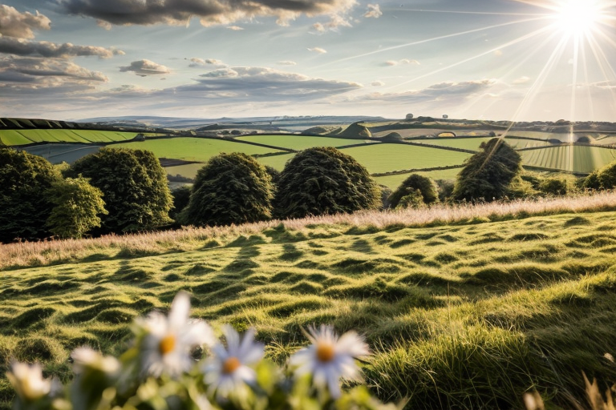


## Image to Image

Model: cartoon.safetensors

Prompt: 
```1girl, masterpiece, high quality best quality```

Negative prompt: 
```EasyNegative, drawn by bad-artist, sketch by bad-artist-anime, (bad_prompt:0.8), (artist name, signature, watermark:1.4), (ugly:1.2), (worst quality, poor details:1.4), bad-hands-5, badhandv4, blurry```

Resize mode: Crop and resize

Steps: 20

Sampler: DPM++ 2M Karras

CFG scale: 7 

Seed: 3239677567 

Size: 512x768 

Denoising strength: 0.55

Input image:

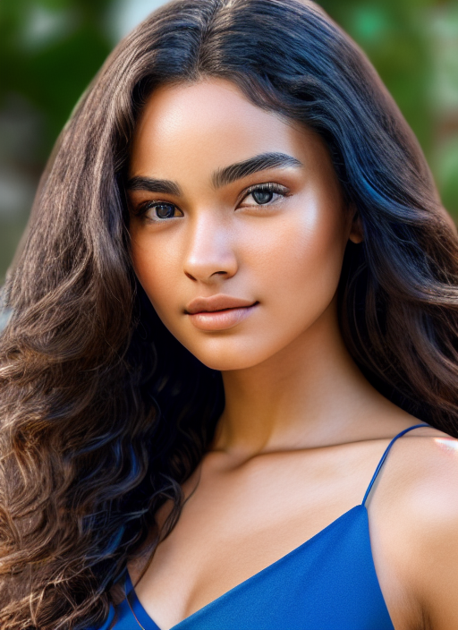

Output image:

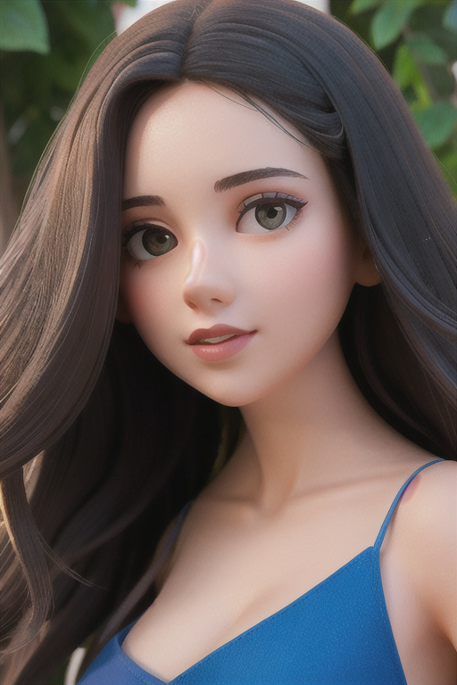


## Inpaint

Model: realistic_v3.safetensors

Prompt: 
```a photo of handsome asian, high detailed face, gentlemen, slightly smile, masterpiece, 8k, hdr, high resolution, high quality, look at viewer```

Negative prompt: 
```ugly, low quality, low resolution, logo, watermark, signature, cropped, out of frame, worst quality,```

Choose inpaint upload

Resize mode: Crop and resize

Mask blur: 1

Inpaint area: Only masked

Steps: 20

Sampler: DPM++ SDE Karras

CFG scale: 6 

Seed: 3239677567 

Size: 512x768 

Denoising strength: 0.5

Input image:

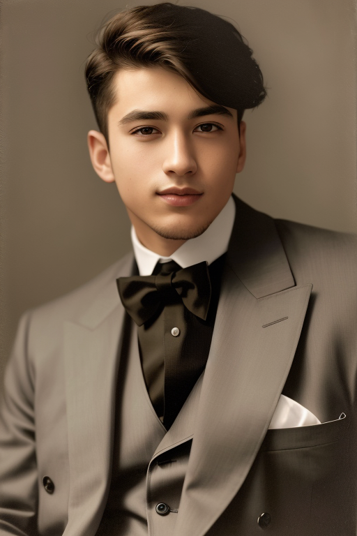

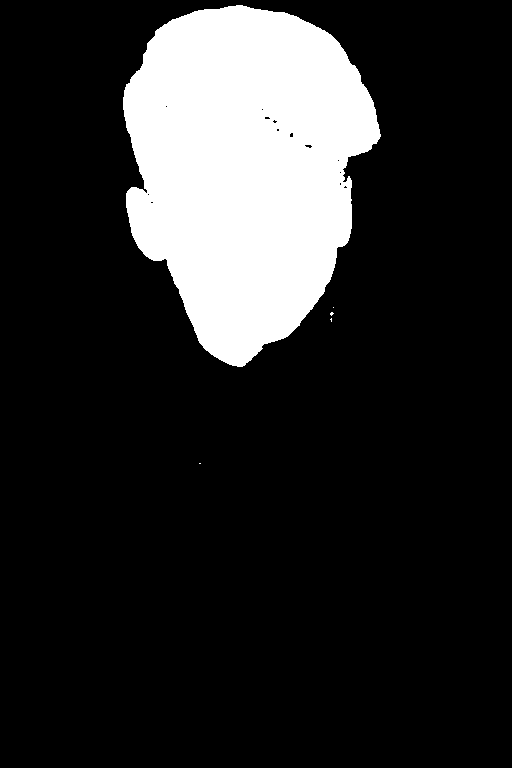

Output image:

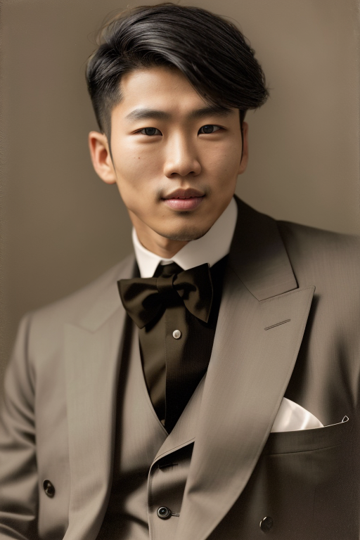


## Outpaint

Choose txt2img

Model: majicmix.safetensors

Sampler: DPM++ SDE Karras

Sampling Step: 80

Size: 512x1024 

CFG scale: 4

Seed: 2025646842

ControlNet:
* Enable
* Preprocessor: inpaint_only+lama
* Model: control_v11p_sd15_inpaint
* Control Mode: ControlNet is more important
* Resize Mode: Resize and Fill

Input image:

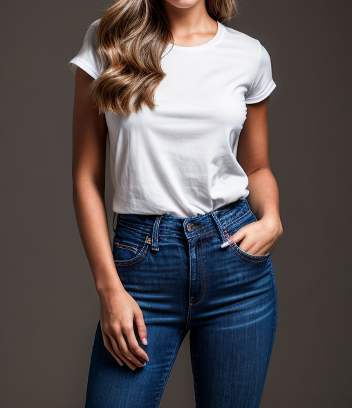

Output image:

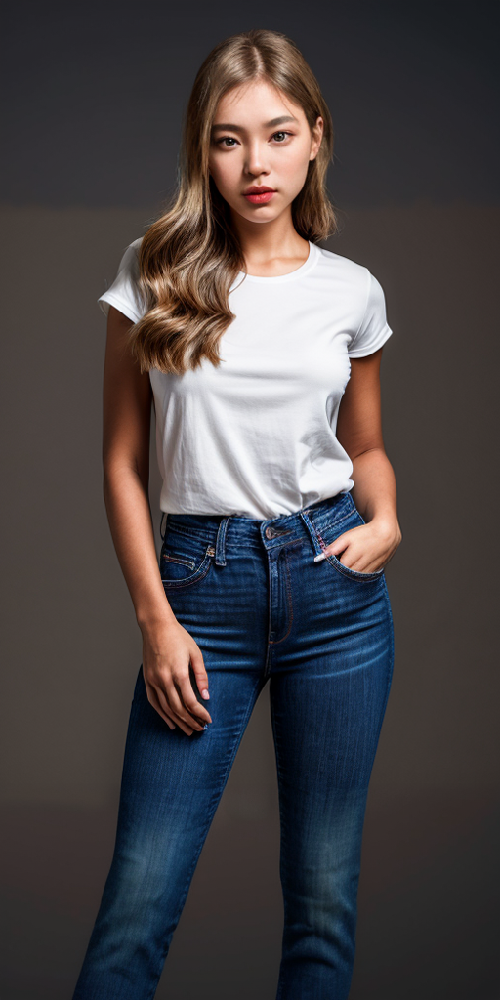


## ControlNet
### Canny

Choose img2img

Model: cartoon.safetensors

Prompt: 
```1girl, cute, dress, bucket hat, (beach:1.2), look at viewer, normal face, high detailed face, smile```

Negative prompt: 
```EasyNegative, drawn by bad-artist, sketch by bad-artist-anime, (bad_prompt:0.8), (artist name, signature, watermark:1.4), (ugly:1.2), (worst quality, poor details:1.4), bad-hands-5, badhandv4, blurry```

Sampler: DPM++ 2M Karras

Sampling Step: 20

Size: 512x512 

CFG scale: 7

Denoising strength: 0.75

Seed: 2942611737

ControlNet:
* Enable
* Preprocessor: canny
* Model: control_v11p_sd15_canny
* Control Mode: Balanced
* Resize Mode: Crop and Resize

Input image:

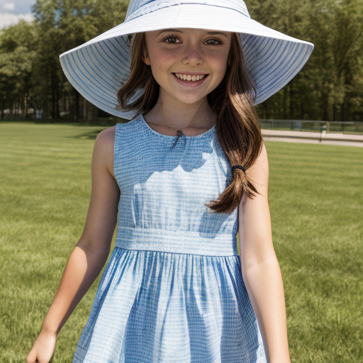

Output image:
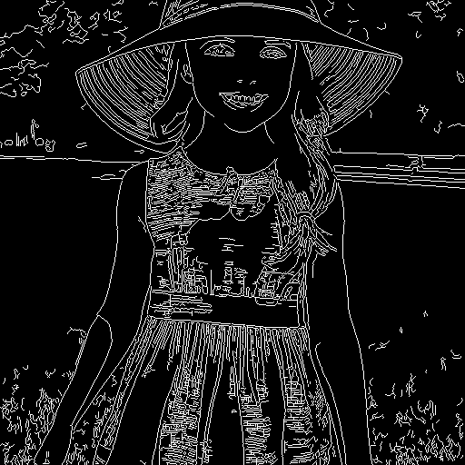
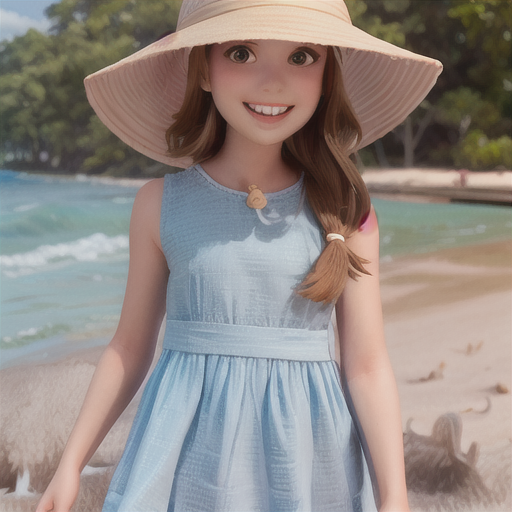


### Depth

Choose img2img

Model: realistic_v3.safetensors

Prompt: 
```bedroom, wabi style, interior design, magazine photo, light, warm, high quality, 8k, hdr,```

Negative prompt: 
```ugly, low quality, low resolution```

Sampler: DPM++ SDE Karras

Sampling Step: 20

Size: 512x512 

CFG scale: 7

Denoising strength: 0.75

Seed: 1792743609

ControlNet:
* Enable
* Preprocessor: depth_midas
* Model: control_v11f1p_sd15_depth
* Control Mode: Balanced
* Resize Mode: Crop and Resize

Input image:

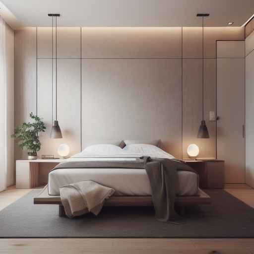

Output image:
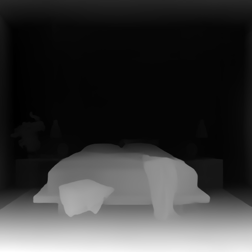
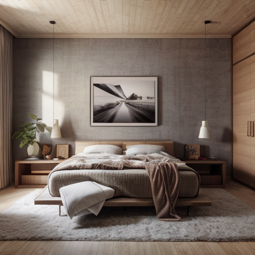


### OpenPose

Choose img2img

Model: realistic_v3.safetensors

Prompt: 
```a young woman, fair and natural skin, (RAW photo, best quality), (realistic, photo-realistic:1.5), 8k, hdr, best quality, slim body, masterpiece, an extremely delicate and beautiful, extremely detailed, masterpiece, best quality, soft lighting, extremely detailed CG unity 8k wallpaper, incredibly cute, huge filesize , ultra-detailed, highres, extremely detailed, beautiful detailed girl, extremely detailed eyes and face, beautiful detailed eyes, light on face, looking at viewer, black hair```

Negative prompt: 
```(nfsw),(Extra limbs), (bad arms), (bad hands), extra fingers, long neck, deformed hands, bad-hands-5, EasyNegative, (symmetry:1.2), facial marking, crown, horn, two face, open mouth, cartoon, high contrast, poorly drawn, Scribbles, Low quality, watermark, text, overlay, nude, naked, ((grayscale)), skin spots, acnes, skin blemishes, age spot,extra fingers, fewer fingers, strange fingers, bad hand, bare thighs```

Sampler: DPM++ SDE Karras

Sampling Step: 20

Size: 512x768

CFG scale: 7

Denoising strength: 0.75

Seed: 227639185

ControlNet:
* Enable
* Preprocessor: openpose_full
* Model: control_v11p_sd15_openpose
* Control Mode: Balanced
* Resize Mode: Crop and Resize

Input image:

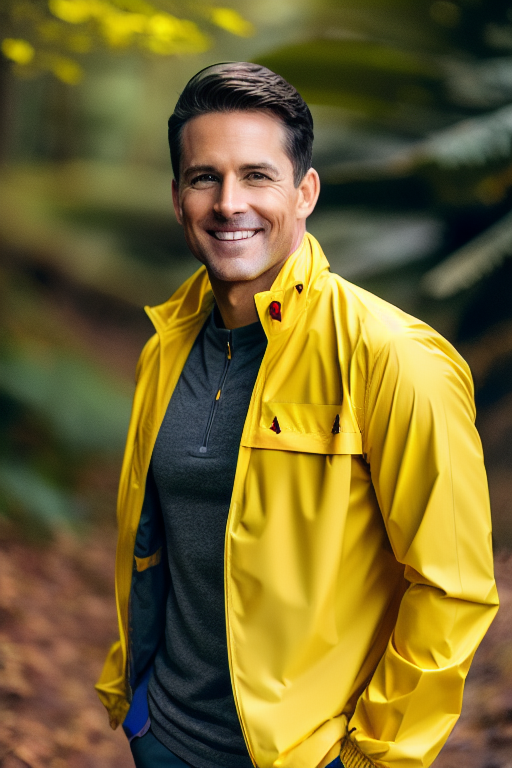

Output image:
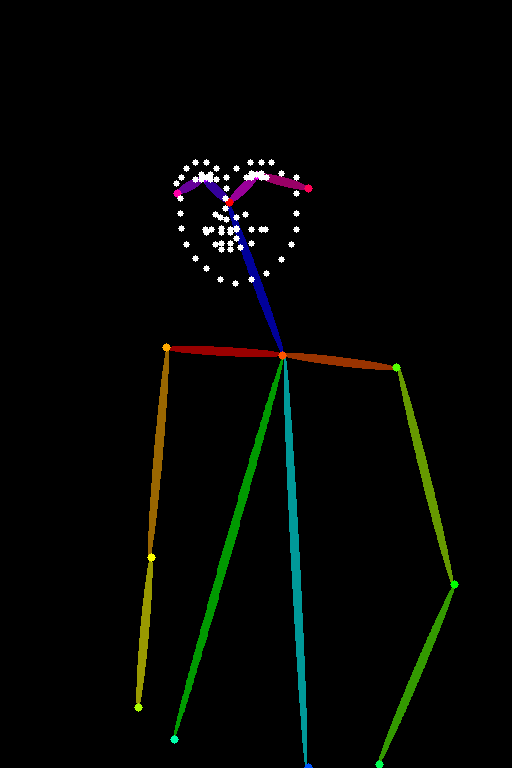
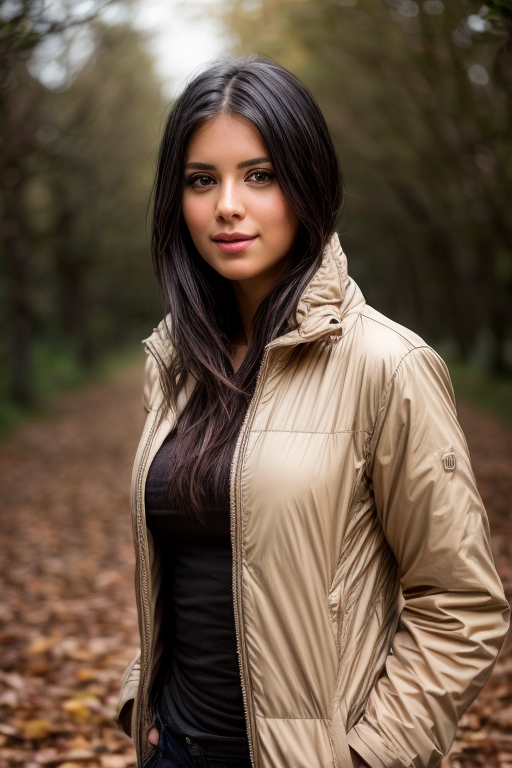
